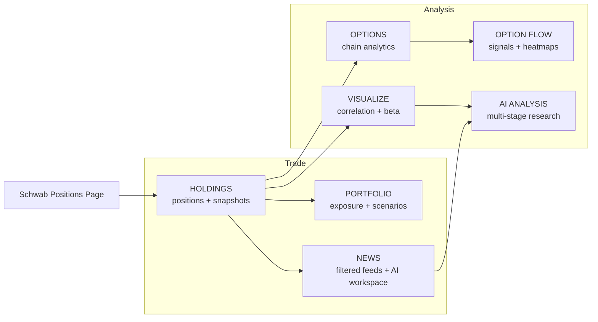
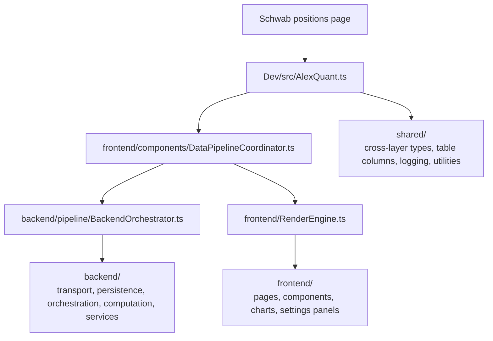

# Schwaber

<div align="center">
  <p>
    <strong>Userscript workspace for Charles Schwab positions</strong>
    <br />
    Holdings analytics, portfolio risk review, options research, option-flow monitoring, market/news context, and AI-assisted analysis in one in-page surface.
  </p>

  <p>
    <a href="USERGUIDE.md">
      
    </a>
    <a href="#quick-start">
      
    </a>
    <a href="Dev/src/README.md">
      
    </a>
  </p>

  <p>
    
    
    
    
  </p>
</div>

> The repository is named `Schwab-Userscript`, while the generated bundle and some runtime labels still use `AlexQuant` / `AlexHedgeFund`. In practice, they refer to the same userscript surface in this repo.

## Choose Your Route

<table>
  <tr>
    <td width="33%" valign="top">
      <strong>Use The Product</strong>
      <br />
      Install the userscript, confirm first render, learn the navigation model, and troubleshoot setup issues.
      <br />
      <br />
      <a href="USERGUIDE.md">Open USERGUIDE.md</a>
    </td>
    <td width="33%" valign="top">
      <strong>Build Or Debug</strong>
      <br />
      Jump straight to build commands, local-loader workflow, and the runtime architecture entry point.
      <br />
      <br />
      <a href="#quick-start">Go To Quick Start</a>
    </td>
    <td width="33%" valign="top">
      <strong>Understand The Codebase</strong>
      <br />
      Read the near-source architecture docs, layer ownership, pipeline flow, and subsystem boundaries.
      <br />
      <br />
      <a href="Dev/src/README.md">Open Dev/src/README.md</a>
    </td>
  </tr>
</table>

## What You Can Do

<table>
  <tr>
    <td width="25%" valign="top">
      <strong><code>HOLDINGS</code></strong>
      <br />
      Live positions, derived metrics, snapshots, and configurable views.
    </td>
    <td width="25%" valign="top">
      <strong><code>PORTFOLIO</code></strong>
      <br />
      Exposure review, scenarios, governance, and rebalance ideas.
    </td>
    <td width="25%" valign="top">
      <strong><code>NEWS</code></strong>
      <br />
      Multi-source market feed with filters and an AI workspace.
    </td>
    <td width="25%" valign="top">
      <strong><code>OPTIONS</code></strong>
      <br />
      On-demand chain analysis, saved views, and copy-out workflows.
    </td>
  </tr>
  <tr>
    <td width="25%" valign="top">
      <strong><code>OPTION_FLOW</code></strong>
      <br />
      Monitor-style dashboards, captures, signals, and heatmaps.
    </td>
    <td width="25%" valign="top">
      <strong><code>VISUALIZE</code></strong>
      <br />
      Correlation, moving beta, overlay charts, and portfolio bubbles.
    </td>
    <td width="25%" valign="top">
      <strong><code>AI_ANALYSIS</code></strong>
      <br />
      Multi-stage research pipeline, history, export, and report workflows.
    </td>
    <td width="25%" valign="top">
      <strong>Default Entry</strong>
      <br />
      The app initializes into Holdings first so you can validate account context fast.
    </td>
  </tr>
</table>

## Workspace Map



## Quick Start

### Requirements

- A modern Chromium or Firefox browser with a userscript manager such as Tampermonkey or Violentmonkey.
- An authenticated Schwab web session on the positions page: `https://client.schwab.com/app/accounts/positions/*`.
- Node.js and npm for local builds.

### Build And Install

```bash
cd Dev
npm install
npm run build
```

Main output:

- `Dev/.dist/AlexQuant.user.js`

Optional developer output:

- `Dev/.dist/AlexQuant.local-loader.user.js`

Install flow:

1. Open your userscript manager.
2. Import or paste `Dev/.dist/AlexQuant.user.js`.
3. Save the script.
4. Open or refresh the Schwab positions page.
5. Verify that the Schwaber / AlexQuant UI shell appears and lands on the Holdings view.

<details>
<summary><strong>Fast Local Iteration</strong></summary>

Use the local-loader bundle when you want a faster edit/build/refresh loop:

1. Run `cd Dev && npm run dev`.
2. Serve the `Dev/` directory at `http://127.0.0.1:5500`.
3. Install `Dev/.dist/AlexQuant.local-loader.user.js`.
4. Open the Schwab positions page and iterate against the served bundle.

The local loader expects the bundle at `http://127.0.0.1:5500/.dist/AlexQuant.user.js`.

</details>

<details>
<summary><strong>Pick The Right Page Fast</strong></summary>

| If you want to... | Open |
| --- | --- |
| Review positions, P/L, Greeks, snapshots, or custom views | `HOLDINGS` |
| Inspect exposure, rebalance ideas, or portfolio-level summaries | `PORTFOLIO` |
| Scan headlines and research them with AI | `NEWS` |
| Load a single symbol's options chain and study strikes or IV | `OPTIONS` |
| Watch flow-style captures, signals, and dashboards | `OPTION_FLOW` |
| Explore correlation, moving beta, overlays, and bubbles | `VISUALIZE` |
| Run a multi-stage AI research pipeline and store reports | `AI_ANALYSIS` |

</details>

## Navigation Model

| Surface | Desktop Group | Mobile Placement | Best For |
| --- | --- | --- | --- |
| Holdings | Trade | Direct tab | Daily account review |
| Portfolio | Trade | Direct tab | Exposure and scenario checks |
| News | Trade | More menu | Market context and AI-assisted news review |
| Options | Analysis | Direct tab | Single-symbol chain analysis |
| Option Flow | Analysis | More menu | Persistent monitoring and signals |
| Visualize | Analysis | Direct tab | Multi-symbol visual analytics |
| AI Analysis | Analysis | More menu | Long-form research workflows |

## System Snapshot



The root README is the entry layer. The authoritative design detail stays close to the source under `Dev/src/**/README.md`.

## Documentation Map

<details open>
<summary><strong>User-Facing Docs</strong></summary>

| Document | Purpose |
| --- | --- |
| [USERGUIDE.md](USERGUIDE.md) | Installation, navigation, pages, workflows, and troubleshooting |
| [Dev/src/README.md](Dev/src/README.md) | Canonical architecture entry and reading routes |

</details>

<details>
<summary><strong>Deep Technical Reading</strong></summary>

| Document | Purpose |
| --- | --- |
| [Dev/src/init-workflow.md](Dev/src/init-workflow.md) | Startup lifecycle from userscript load to first render |
| [Dev/src/backend/pipeline/holdings-pipeline.md](Dev/src/backend/pipeline/holdings-pipeline.md) | Holdings ingestion and derived-state flow |
| [Dev/src/backend/services/ai/ai-workflow.md](Dev/src/backend/services/ai/ai-workflow.md) | AI pipeline stages, persistence, streaming, and search |
| [Dev/src/frontend/ui-and-charting.md](Dev/src/frontend/ui-and-charting.md) | Shared UI and charting conventions |

</details>

<details>
<summary><strong>Critical Contributor Docs</strong></summary>

| Document | Purpose |
| --- | --- |
| [.docs/devPlan/regulation/Timezone.md](.docs/devPlan/regulation/Timezone.md) | Required pre-read before time, timestamp, or timezone work |
| [Dev/src/backend/core/db/README.md](Dev/src/backend/core/db/README.md) | IndexedDB ownership and persistence boundaries |
| [Dev/src/backend/core/network/README.md](Dev/src/backend/core/network/README.md) | Transport and normalization boundary |

</details>

## Development Workflow

Run all npm commands from `Dev/`.

| Command | Purpose |
| --- | --- |
| `npm run build` | Build the production userscript into `.dist/` |
| `npm run dev` | Watch-mode build for local iteration |
| `npm run lint` | Run ESLint across JS and TS sources |
| `npm run typecheck` | Run TypeScript without emitting output |
| `npm run test` | Run the Jest test script exposed by `package.json` |
| `npm run format` | Format supported source and doc files |

## Suggested Reading Paths

| Goal | Read This |
| --- | --- |
| Use the tool quickly | [USERGUIDE.md](USERGUIDE.md) |
| Contribute to the codebase | [Dev/src/README.md](Dev/src/README.md), then [Dev/src/init-workflow.md](Dev/src/init-workflow.md) |
| Understand architecture fast | [Dev/src/README.md](Dev/src/README.md), [Dev/src/backend/README.md](Dev/src/backend/README.md), [Dev/src/frontend/README.md](Dev/src/frontend/README.md), [Dev/src/shared/README.md](Dev/src/shared/README.md) |

## Repository Layout

<details>
<summary><strong>Expand Layout</strong></summary>

```text
.
├── README.md
├── USERGUIDE.md
├── AGENTS.md
├── CLAUDE.md
├── .docs/
│   ├── devPlan/
│   ├── data corr/
│   ├── debug_log/
│   └── schwab_page_source_code/
└── Dev/
    ├── package.json
    ├── webpack.config.js
    ├── .dist/
    └── src/
        ├── AlexQuant.ts
        ├── backend/
        ├── frontend/
        └── shared/
```

</details>

## Contributor Notes

- Near-source docs under `Dev/src/**/README.md` remain the source of truth for layer ownership and local design decisions.
- When you change a workflow, invariant, or schema, update the nearest local README and related topic doc in the same change.
- Before any time-related work, read [.docs/devPlan/regulation/Timezone.md](.docs/devPlan/regulation/Timezone.md).
- Research artifacts, captured upstream payloads, and planning material live under `.docs/`.
