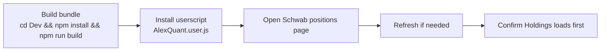
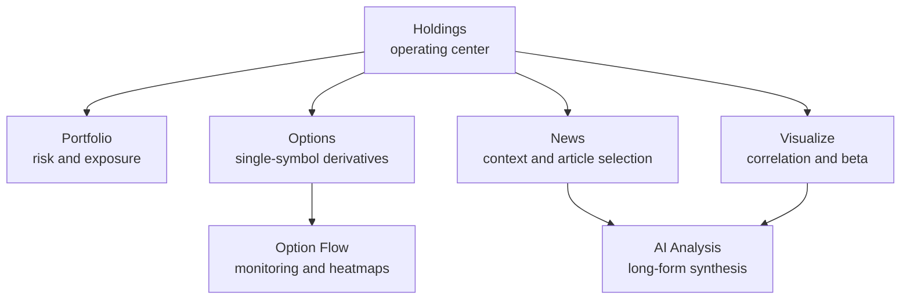

# Schwaber User Guide

<div align="center">
  <p>
    <strong>Install it fast. Find the right page fast. Recover from common issues fast.</strong>
    <br />
    This guide explains how to install, navigate, and use the Schwaber / AlexQuant userscript on Charles Schwab positions pages.
  </p>

  <p>
    <a href="#install-and-first-launch">
      
    </a>
    <a href="#which-page-should-i-open">
      
    </a>
    <a href="#troubleshooting">
      
    </a>
    <a href="Dev/src/README.md">
      
    </a>
  </p>

  <p>
    
    
    
    
  </p>
</div>

> For source-oriented architectural reading, jump to [Dev/src/README.md](Dev/src/README.md).

## Scope

Use this guide when you want to:

- install the userscript and confirm it is working
- understand how the UI is organized on desktop and mobile
- know which page to open for a specific task
- learn the main daily workflows without reading source-level architecture docs
- troubleshoot the most common setup and runtime problems

## Fast Routes

<table>
  <tr>
    <td width="33%" valign="top">
      <strong>First-Time Setup</strong>
      <br />
      Build the bundle, install the userscript, open the Schwab positions page, and confirm Holdings renders.
      <br />
      <br />
      <a href="#install-and-first-launch">Go To Install And First Launch</a>
    </td>
    <td width="33%" valign="top">
      <strong>Daily Usage</strong>
      <br />
      Decide whether you should start in Holdings, Portfolio, News, Options, Option Flow, Visualize, or AI Analysis.
      <br />
      <br />
      <a href="#which-page-should-i-open">Go To Which Page Should I Open?</a>
    </td>
    <td width="33%" valign="top">
      <strong>Something Broke</strong>
      <br />
      Work through the most common reasons the UI is missing, auth is stale, the local loader fails, or data looks stale.
      <br />
      <br />
      <a href="#troubleshooting">Go To Troubleshooting</a>
    </td>
  </tr>
</table>

## Before You Begin

### What This Project Is

Schwaber is an in-browser overlay and analysis workspace for the Schwab positions experience. It does not replace the Schwab site; it augments the positions page with additional analytics, views, and local persistence.

### What You Need

| Requirement | Why It Matters |
| --- | --- |
| A userscript manager such as Tampermonkey or Violentmonkey | The project runs as an installed userscript bundle |
| A logged-in Schwab session | Many surfaces depend on live account and auth context |
| Access to `https://client.schwab.com/app/accounts/positions/*` | The userscript is designed around the positions experience |
| A built local bundle if you are installing from this repo | The script you install comes from `Dev/.dist/` |

### Important Expectations

- The tool is designed around the positions page and related account context.
- Some advanced surfaces depend on live auth/session state from Schwab.
- Some advanced features persist settings and history locally in IndexedDB.
- AI features require AI-provider configuration inside the app before they become useful.

## Install And First Launch

### Install Flow



### Step 1: Build The Bundle

```bash
cd Dev
npm install
npm run build
```

Main output:

- `Dev/.dist/AlexQuant.user.js`

Optional developer output:

- `Dev/.dist/AlexQuant.local-loader.user.js`

### Step 2: Install The Userscript

1. Open your userscript manager.
2. Import or paste `Dev/.dist/AlexQuant.user.js`.
3. Save it.
4. Open the Schwab positions page.
5. Refresh if needed.

### Step 3: Confirm First Render

On a successful first render you should see the Schwaber / AlexQuant UI container and land on the Holdings view.

If you do not, go straight to [Troubleshooting](#troubleshooting).

<details>
<summary><strong>Developer Loop: Local Loader</strong></summary>

Use the local-loader bundle when you want a faster edit/build/refresh loop:

1. Run `cd Dev && npm run dev`.
2. Serve the `Dev/` directory at `http://127.0.0.1:5500`.
3. Install `Dev/.dist/AlexQuant.local-loader.user.js`.
4. Open the Schwab positions page and iterate against the served bundle.

The local loader expects the bundle at `http://127.0.0.1:5500/.dist/AlexQuant.user.js`.

</details>

## How The UI Is Organized

### Navigation Model

| Surface | Desktop Group | Mobile Placement | Best For |
| --- | --- | --- | --- |
| Holdings | Trade | Direct tab | Daily account review and position validation |
| Portfolio | Trade | Direct tab | Exposure and scenario review |
| News | Trade | More menu | Market context and article-driven research |
| Options | Analysis | Direct tab | Focused single-symbol chain analysis |
| Option Flow | Analysis | More menu | Monitoring-style derivatives dashboard |
| Visualize | Analysis | Direct tab | Correlation, beta, overlays, and bubble views |
| AI Analysis | Analysis | More menu | Multi-stage research workflows |

### Default Landing Page

The application initializes into Holdings first. That is the fastest way to confirm your account context, positions, and derived metrics are available.

### Mental Model



## Which Page Should I Open?

| If you want to... | Open | Why |
| --- | --- | --- |
| review positions, P/L, Greeks, snapshots, or custom table views | Holdings | It is the core live operating surface |
| inspect exposure, rebalance ideas, or scenario/risk summaries | Portfolio | It aggregates portfolio-level views |
| scan headlines and immediately research them with AI | News | It combines feed filtering with a right-rail AI workspace |
| load a single symbol's options chain and study expiries, strikes, IV, or saved views | Options | It is the focused single-symbol analysis surface |
| watch option-flow style captures, signals, and dashboards | Option Flow | It is the monitoring/heatmap surface |
| explore correlation, moving beta, overlays, and bubble charts | Visualize | It is the best page for multi-symbol visual analysis |
| run a multi-stage AI analysis pipeline and store reports | AI Analysis | It is the long-form research surface |

## Page Guide

<details open>
<summary><strong>Holdings</strong> — fastest operational view of the account</summary>

**What it focuses on**

- live holdings table and derived metrics
- configurable table views and local preferences
- account snapshot and history/timeline surfaces
- a natural first stop before you branch into Portfolio or Options

**Typical use cases**

- morning account scan
- after-hours check on key names
- spot-checking Greeks, concentration, beta, or warning fields
- comparing different table views for trading vs. long-horizon review

**Related technical docs**

- [Dev/src/frontend/trade_holdings/README.md](Dev/src/frontend/trade_holdings/README.md)
- [Dev/src/backend/pipeline/holdings-pipeline.md](Dev/src/backend/pipeline/holdings-pipeline.md)

</details>

<details>
<summary><strong>Portfolio</strong> — portfolio-level risk instead of single-row positions</summary>

**What it focuses on**

- exposure panels
- scenario and stress-style summaries
- governance controls
- rebalance-oriented ideas and signals

**Typical use cases**

- review portfolio beta and Greeks concentration
- check whether a recent move changed your risk posture
- scan for rebalance ideas before trade planning

**Related technical docs**

- [Dev/src/frontend/trade_portfolio/README.md](Dev/src/frontend/trade_portfolio/README.md)
- [Dev/src/backend/computation/README.md](Dev/src/backend/computation/README.md)

</details>

<details>
<summary><strong>News</strong> — event context and filtered market/news stream</summary>

**What it focuses on**

- source filters
- symbol filters
- search
- read-state management
- copy and export of filtered news sets
- right-rail AI workspace over selected or filtered articles

**Data sources surfaced by the repo**

- Schwab news
- Yahoo news and macro feeds
- Barron's fetchers
- Financial Juice feed support

**Typical use cases**

- scan only a specific symbol's headlines
- filter down to one source for a cleaner read
- select a set of stories and hand them to the AI workspace

**Related technical docs**

- [Dev/src/backend/services/news/README.md](Dev/src/backend/services/news/README.md)
- [Dev/src/frontend/README.md](Dev/src/frontend/README.md)

</details>

<details>
<summary><strong>Options</strong> — on-demand chain view for a specific underlying</summary>

**What it focuses on**

- symbol-driven chain loading
- expiries, strike windows, liquidity filters, and scope controls
- saved views and copy-out workflows
- page-local chart orchestration over computed options analytics

**Typical use cases**

- compare expiries before entering a trade
- focus on a strike cluster and inspect IV and exposure characteristics
- save a view state and revisit it later
- export a copy-out payload for external notes or comparison

**Related technical docs**

- [Dev/src/frontend/analysis_options/README.md](Dev/src/frontend/analysis_options/README.md)
- [Dev/src/backend/core/network/README.md](Dev/src/backend/core/network/README.md)

</details>

<details>
<summary><strong>Option Flow</strong> — monitor-style derivatives dashboard</summary>

**What it focuses on**

- monitor capture
- dashboard state and query engine
- option-flow charts and heatmaps
- local signals and panel-based monitoring

**Typical use cases**

- watch evolving flow behavior over a symbol universe
- inspect signals and heatmaps instead of a single symbol chain
- keep a persistent monitoring page open while moving between other views

**Related technical docs**

- [Dev/src/frontend/analysis_optionFlow/README.md](Dev/src/frontend/analysis_optionFlow/README.md)
- [Dev/src/backend/core/db/README.md](Dev/src/backend/core/db/README.md)

</details>

<details>
<summary><strong>Visualize</strong> — charts and relationships instead of raw tables</summary>

**What it focuses on**

- moving beta views
- correlation and beta heatmaps
- dual overlays and time series surfaces
- portfolio bubble charts

**Typical use cases**

- compare account names or symbols visually
- inspect rolling beta behavior
- scan correlation clusters before portfolio changes

**Related technical docs**

- [Dev/src/frontend/analysis_visualize/README.md](Dev/src/frontend/analysis_visualize/README.md)
- [Dev/src/frontend/ui-and-charting.md](Dev/src/frontend/ui-and-charting.md)

</details>

<details>
<summary><strong>AI Analysis</strong> — longer-form, multi-stage research workflow</summary>

**What it focuses on**

- provider and model selection
- pipeline configuration
- staged execution and streamed results when enabled
- history, stored analyses, and report-style output

**Pipeline stages surfaced by the backend docs**

```text
fetching_data
  -> running_analysts
  -> running_debate
  -> running_trader
  -> running_risk
  -> finalizing
```

**Typical use cases**

- run a research pass before a new trade idea
- compare the AI report against your own market and news read
- store prior analyses and revisit decisions later

**Related technical docs**

- [Dev/src/frontend/analysis_ai/README.md](Dev/src/frontend/analysis_ai/README.md)
- [Dev/src/backend/services/ai/ai-workflow.md](Dev/src/backend/services/ai/ai-workflow.md)

</details>

## Suggested Daily Workflows

| Workflow | Start Here | Then Go To |
| --- | --- | --- |
| Morning account check | Holdings | Portfolio, then News if a symbol moved unexpectedly |
| Research a potential options trade | Holdings or News | Options, then Option Flow or AI Analysis |
| Risk review before rebalancing | Portfolio | Visualize, then Holdings |
| Event-driven research loop | News | AI Analysis, then Portfolio or Options |

<details>
<summary><strong>1. Morning Account Check</strong></summary>

1. Open Holdings.
2. Scan overall table state, warnings, and any custom table view you rely on.
3. Jump to Portfolio if you want a portfolio-level read rather than single rows.
4. Open News for context on symbols that moved unexpectedly.

</details>

<details>
<summary><strong>2. Research A Potential Options Trade</strong></summary>

1. Start in Holdings or News to decide which symbol deserves attention.
2. Open Options for a focused symbol chain view.
3. Refine expiries, strikes, and liquidity windows.
4. If you want broader monitoring context, jump to Option Flow.
5. If you want a longer synthesis, finish in AI Analysis.

</details>

<details>
<summary><strong>3. Risk Review Before Rebalancing</strong></summary>

1. Open Portfolio for exposure, scenarios, and rebalance ideas.
2. Use Visualize to inspect correlation or rolling beta relationships.
3. Return to Holdings to review row-level details before deciding on changes.

</details>

<details>
<summary><strong>4. Event-Driven Research Loop</strong></summary>

1. Open News and filter down by symbol or source.
2. Select the stories that matter.
3. Use the AI workspace or AI Analysis page to synthesize what changed.
4. Cross-check exposures in Portfolio or chain details in Options.

</details>

## Settings, Persistence, And Data

| Topic | What To Know |
| --- | --- |
| What is stored locally | Settings and preferences, saved options views, monitor captures and dashboard state, account snapshot and history data, AI analysis history, and AI memory records |
| What usually requires configuration | AI providers and models, news refresh and source settings, and per-page preferences or view settings |
| What usually depends on active Schwab context | Account-aware holdings rendering, option chain loading, and certain live or refreshed portfolio, news, or account computations |

Clearing browser site data or IndexedDB can remove these local artifacts.

## Troubleshooting

<details open>
<summary><strong>The UI Does Not Appear</strong></summary>

Check the following:

1. The userscript is enabled in your script manager.
2. You are on the Schwab positions URL covered by the userscript match rule.
3. You refreshed after installing the script.
4. The build actually produced `Dev/.dist/AlexQuant.user.js`.

</details>

<details>
<summary><strong>The Options Page Says It Is Waiting For Auth Token</strong></summary>

This usually means the page or session context was not ready or has expired.

Try:

1. Refresh the Schwab positions page.
2. Confirm you are fully logged in.
3. Return to Holdings first, then re-open Options.

</details>

<details>
<summary><strong>The Local Loader Fails With A Network Error</strong></summary>

The local-loader workflow expects:

- `cd Dev && npm run dev` running in watch mode
- the `Dev/` directory served at `http://127.0.0.1:5500`
- the bundle available at `http://127.0.0.1:5500/.dist/AlexQuant.user.js`

If any of those are missing, the local-loader script cannot fetch the current bundle.

</details>

<details>
<summary><strong>News Is Empty Or AI Does Not Produce Useful Output</strong></summary>

Check:

1. the source filters are not excluding everything
2. AI and provider settings are configured
3. you actually selected or filtered items when using the AI workspace
4. the current market and news sources are enabled in settings

</details>

<details>
<summary><strong>Data Looks Stale</strong></summary>

Check:

1. whether the market or session context actually changed
2. whether your current page is still authenticated
3. whether you need to manually refresh the relevant surface
4. whether the issue is tied to a feature-specific setting or saved view state

</details>

## For Contributors And Power Users

| Document | Why You Would Open It |
| --- | --- |
| [README.md](README.md) | Repo-level overview and development commands |
| [Dev/src/README.md](Dev/src/README.md) | Canonical architecture entry |
| [Dev/src/init-workflow.md](Dev/src/init-workflow.md) | Startup lifecycle |
| [.docs/devPlan/regulation/Timezone.md](.docs/devPlan/regulation/Timezone.md) | Required pre-read before time-related changes |

## Summary

If you remember only one thing, remember this navigation model:

- Holdings is the operating center.
- Portfolio and Visualize are for risk and relationship views.
- Options and Option Flow are for derivatives analysis and monitoring.
- News and AI Analysis are for context, synthesis, and decision support.

Start with Holdings, branch based on the question you are trying to answer, and use the near-source docs when you need feature-level implementation depth.
